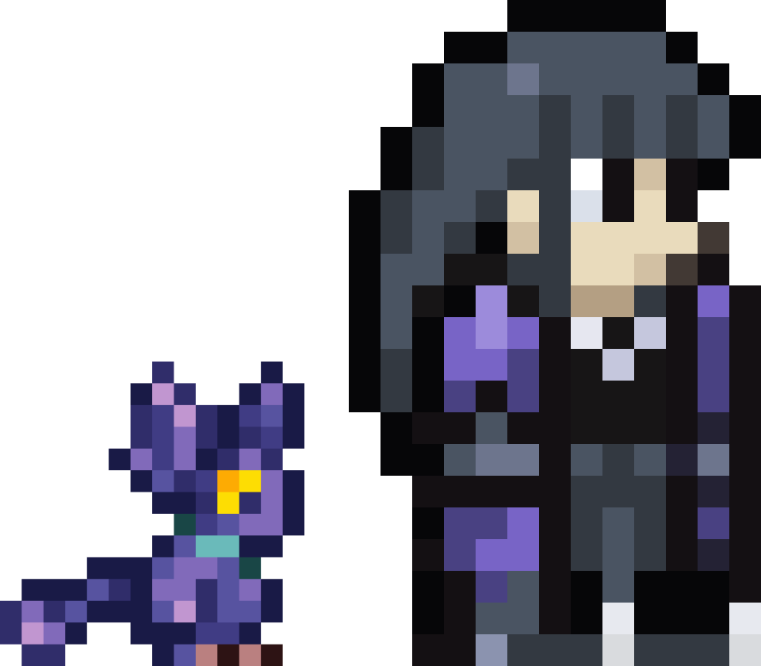

<!-- welcome -->
<h1 align="center">
         
</h1>

<!-- introduction -->

  <h2 align="center">Brazilian Java Backend Developer </h2> 
  
hey there! 🧛🏻‍♀️ I'm a java backend developer 

  
 currently working on some projects and also learning spring boot. if you are interested in checking out my stuff and exploring what I'm working on, feel free to take a look at my repositories. also, add me on Linkedin - always open to community feedback and interaction 💻

  

<!-- total commits -->
<!-- 
 

  
   
    

-->
 

## Focused on

 

 

<!--  -->

<!--  -->

<h3> Tech Stack </h3> 

<!--  -->

<!-- contact into -->

 

<h2 align="center"> reach out to me  </h2>

<!--https://em-content.zobj.net/source/microsoft/309/ninja-cat_1f431-200d-1f464.png -->

 

  
  

###

